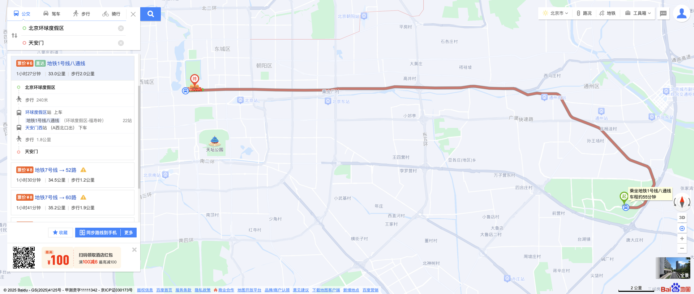

# Baidu Map 公交路线爬取与截图

这是一个使用 **Selenium + Python + PIL** 实现的百度地图公交/地铁路线爬取工具。  
可以获取两点之间的公交/地铁路线信息，包括票价、路线标签、路线耗时、总距离、步行距离，以及每段路线的详细上下车站点信息，同时对路线地图进行截图保存。

## 功能

1. 输入起点和终点，自动搜索公交/地铁路线。
2. 获取每条路线的：
   - 路线名称
   - 票价
   - 路线标签（如直达）
   - 耗时
   - 总距离
   - 步行距离
3. 获取路线详细分段信息：
   - 步行段：距离
   - 公交/地铁段：上车站、下车站、线路名称、起始终点站、途经站点数
4. 对每条路线截图保存至本地 `map_images` 文件夹。

## 环境要求

- Python 3.8+
- Chrome 浏览器
- 对应版本的 [ChromeDriver](https://chromedriver.chromium.org/downloads)
- Python 库：
  - selenium
  - pillow

## 使用方法

1. 修改脚本中的 ChromeDriver 路径：

   service = Service("/path/to/chromedriver")

2. 修改起点和终点：

   start = "环球影城"
   end = "天安门"

3. 运行脚本

### 注意事项：

- time.sleep可根据网络情况适当调整
- 默认爬取公交/地铁路线，如果页面默认是驾车路线，会自动点击公交标签

## 输出示例

>len(route_li_elements)=3
>路线名称：地铁1号线八通线，票价：票价¥6，标签：最快，耗时：1小时27分钟，距离：33.0公里，步行距离：步行2.0公里
>以下是路线的分段路径：
>分段类型：walk，距离：步行  240米
>分段类型：bus，线路名：地铁1号线八通线，上车站点：环球度假区站  上车，下车站点：天安门西站 （A西北口出） 下车  ，线路始末站：（环球度假区-福寿岭），途经站点数：22站
>分段类型：walk，距离：步行  1.8公里
>
>路线无标签
>路线名称：地铁7号线→120路，票价：票价¥8，标签：无，耗时：1小时39分钟，距离：33.0公里，步行距离：步行1.5公里
>以下是路线的分段路径：
>分段类型：walk，距离：步行  230米
>分段类型：bus，线路名：地铁7号线，上车站点：环球度假区站  上车，下车站点：珠市口站 （F东南口出） 下车  ，线路始末站：（环球度假区-北京西站），途经站点数：23站
>分段类型：walk，距离：步行  490米
>地铁或公交没有提供始末站数据
>分段类型：bus，线路名：120路，上车站点：珠市口南站  上车，下车站点：天安门东站 下车  ，线路始末站：未提供，途经站点数：3站
>分段类型：walk，距离：步行  830米
>
>路线无标签
>路线名称：地铁7号线→夜2路，票价：票价¥8，标签：无，耗时：1小时42分钟，距离：33.0公里，步行距离：步行1.8公里
>以下是路线的分段路径：
>分段类型：walk，距离：步行  230米
>分段类型：bus，线路名：地铁7号线，上车站点：环球度假区站  上车，下车站点：珠市口站 （F东南口出） 下车  ，线路始末站：（环球度假区-北京西站），途经站点数：23站
>分段类型：walk，距离：步行  490米
>地铁或公交没有提供始末站数据
>分段类型：bus，线路名：夜2路，上车站点：珠市口南站  上车，下车站点：南河沿站 下车  ，线路始末站：未提供，途经站点数：5站
>分段类型：walk，距离：步行  1.1公里
>
>
>
>
>
>
>
>
>
>
>
>

